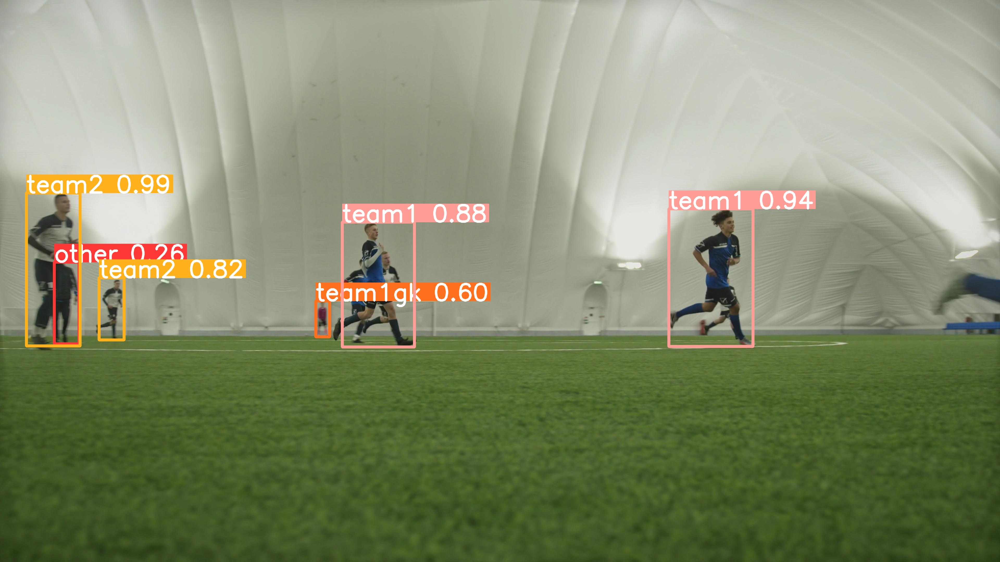

# Question #2

## Computer Vision knowledge

### Problem description:

In Fluendo we are developing an AI-based system to automatize some sport analysis tools in order to help experts as coaches or scouts to identify a team's strong & weak points during a game or training session from a set of recorded images/videos.

Typical use-cases:

- Team heat-maps drawing: 

- Virtual Assistant referee tools:

- Player action recognition:

In order to provide these smart functionalities one of the most important milestones is to achieve an accurate **team detection & classification system** which allow us to distinguish among players of different teams and discard referees and coaches. 

In this test you will be asked about this last functionality (see below image as reference)

## Test:

### Assumptions:

- Both traditional and modern (Deep Learning) techniques can be proposed

  

### Questions:

Please provide a document (and extra data if any) answering each question below.

1. Which algorithms would you use to achieve this? Please provide at least 2 proposals

The first approach could be using HoG descriptors to detect people in the image and then use the colour information inside the region, with some filters, to make the classification. This approach needs to adjust the filters according to the colours of the team/referee. One 

Another approach that relies less on human intervention could be [YOLO](https://github.com/ultralytics/yolov5). It could be trained to detect and classify people according to their cloths. However, particular attention should be paid to the cases where the teams/referees use very similar colors. 

2. Which potential bottlenecks may this problem encounter? (i.e. non-static camera). Just list them (if any)

* In this case, weather/lighting conditions can affect the classification.

* Another problem may be people overlapping, which can cause a mis-classification.

* Finally, similar clothes between the different teams.

3. Could your proposals be scaled to other team-based sports? (i.e. hockey, rugby, ...) Which would be worst-case scenarios?

There should be no problem for the cases where the teams have some color distinction. For the case of the handcrafted method, maybe the descriptors should adapt more to the new common people poses. 

The worst case would be near identical cloths with very close players, in which the system will struggle to make the classification.

3. Extra: provide a sample code with some proposal running

The system classificator has been implemented with [YOLOv8](https://github.com/ultralytics/ultralytics/tree/main)

The [video](https://www.pexels.com/video/people-playing-soccer-6077729/) has been downloaded from `https://www.pexels.com/search/videos/football/`

The steps to train and evaluate the classificator are:
* Install the requirements from the ultralytics folder

`pip install pip install -r ultraytics/requirements.txt`. 

There was a problem with the `protobuf` version, it had to be changed in the requirements file to `protobuf==3.20.0`.

* Extract the frames from the video using the `video_parse.py` file.

* Generate the people labels by predicting with YOLOv8 COCO weights, using the `auto_labeler.py` file. There are several model available:

| Model                                                                                       | size (pixels) | params (M) |
| ------------------------------------------------------------------------------------------- | --------------------- |----------------|
| YOLOv8n | 640                   | 3.2            |
| YOLOv8s | 640                   | 11.2           |
| YOLOv8m | 640                   | 25.9           |
| YOLOv8l | 640                   | 43.7           |
| YOLOv8x | 640                   | 68.2           |

(The system will download automatically any of them if selected)

* Upload the images and labels to [Roboflow](https://roboflow.com/). This step can also be done by adjusting the labels manually in the .txt files, but it is more time-consuming.

* Adjust the classes, by adding the teams labels and the other needed labels.

* Export the dataset in YOLOv8 format, and save it to the `ultralytics/datasets/` folder. The resulting dataset from this test can be found [here](https://universe.roboflow.com/izan-leal-garcia/football-detector-mimk2/dataset/1). 

* Re-train the model with the new dataset, using the previous YOLOv8 COCO weights for model initialization, with the `classifier.py` file. New weights are saved in the `runs/detect/trainX/weights/` folder.

* Use the new trained weights to make a prediction with the `classifier.py` file. 
